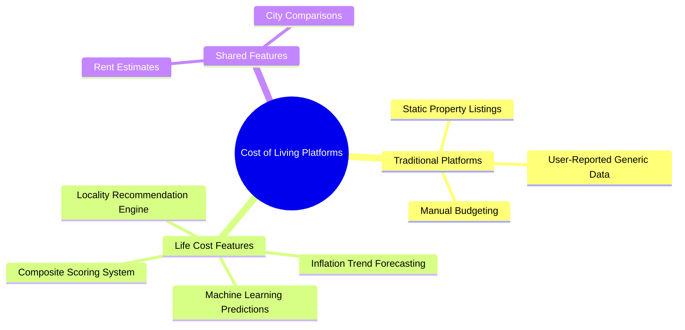

# Life Cost Project Presentation

## Slide 1: Title Page
**Project Title:** Life Cost: AI-Powered Cost of Living Analytics for Madhya Pradesh
**Team Members:** 
- [Student Name 1] (Enrollment No. / ID)
- [Student Name 2] (Enrollment No. / ID)
- [Student Name 3] (Enrollment No. / ID)
**Supervisor Name:** [Professor / Guide Name]

---

## Slide 2: Objective
**Aim & Purpose:**
- To provide deep insights into the cost of living across Madhya Pradesh (with a strong focus on Bhopal).
- To assist individuals, students, and professionals in planning their relocation and budget by answering crucial questions about rent, groceries, transportation fares, and localized inflation.

**Motivation:**
- Migrating to a new city involves financial uncertainty.
- Existing tools lack localized accuracy and rely on static, outdated data rather than dynamic predictive modeling.
- The need for an intelligent platform that balances lifestyle preferences with salary constraints.

---

## Slide 3: Existing Projects & Differences
**Existing Solutions:**
- Global cost of living calculators (e.g., Numbeo, Expatistan) rely on user-reported, highly generalized data.
- Real estate portals (e.g., MagicBricks, 99acres) only provide standalone property listings without context of grocery or transport costs.

**Difference / Life Cost Advantage:**
- **Predictive AI over Static Data:** Uses 5 core Machine Learning algorithms instead of simple database lookups.
- **Holistic View:** Combines housing, daily groceries, metro fares, and macroeconomic indicators (CPI) into a single Cost-of-Living Composite Index.
- **Hyper-Localized:** specifically engineered for Madhya Pradesh / Bhopal using localized datasets.

### Comparison: Life Cost vs. Traditional Platforms

**Comparison Table:**

| Feature | Traditional Platforms (e.g., Numbeo, MagicBricks) | Life Cost |
| :--- | :--- | :--- |
| **Data Source** | User-reported (often outdated) or Static Listings | Real-time, localized scraped data (Blinkit, OLX, Govt CPI) |
| **Methodology** | Simple Database Lookups & Averages | 5 Core Predictive Machine Learning Models |
| **Scope** | Disjointed (Only Rent OR Only Groceries) | Holistic (Rent + Groceries + Transport + Inflation) |
| **Personalization** | Generic City-wide Estimates | Hyper-localized based on Salary, Workplace, and Lifestyle |
| **Trend Forecasting**| Static current values | Predictive ARIMA modeling for Future Inflation Trends |

**Venn Diagram / Feature Overlap:**

---

## Slide 4: Project Modules - Part 1 (Core AI Models)
**1. Rent Price Predictor**
- **Purpose:** Predicts monthly residential rent based on size (sqft), BHK, and city.
- **Algorithm:** Random Forest Regressor & Ensemble Learning.

**2. CPI Inflation Trend Forecaster**
- **Purpose:** Forecasts the Consumer Price Index for the next 6 months to track inflation trends.
- **Algorithm:** ARIMA (Time Series) with Linear Regression fallback on lag features.

**3. Metro Fare Classifier**
- **Purpose:** Classifies Bhopal Metro routes into logical fare tiers (₹10, ₹20, or ₹30).
- **Algorithm:** Decision Tree Classifier mapping route distance, stops, and travel time.

---

## Slide 5: Project Modules - Part 2 (Recommendation & System Architecture)
**4. Locality Recommender**
- **Purpose:** Recommends top 5 residential areas based on salary, workplace distance, and lifestyle preferences.
- **Algorithm:** Weighted Composite Scoring System using the Haversine distance formula.

**5. Grocery Model & Composite Index**
- **Purpose:** Computes average daily/monthly grocery costs and normalizes all combined living costs against a January 2021 baseline.

**System Components & Associations:**
- **Backend:** FastAPI (Python) serving Machine Learning endpoints logically.
- **Frontend:** Vanilla HTML/CSS/JS, utilizing Chart.js for trends and Leaflet.js for interactive maps.
- **Deployment:** Fully Dockerized architecture for seamless scaling and environment consistency.

*(Insert System Architecture Diagram summarizing Frontend <-> REST API <-> ML Models)*

---

## Slide 6: Outcome
**Project Outcome:**
- A robust, full-stack RESTful application providing accurate and real-time cost-of-living forecasts.
- An interactive dashboard that helps users visualize inflation trends, locate properties, and estimate monthly expenses clearly.

**Service to the Public Community:**
- **Financial Planning:** Helps young professionals and families manage their budgets before relocating to MP.
- **Empowerment:** Democratizes access to complex real-estate and economic data via simple, user-friendly insights.
- **Transparency:** Provides a data-backed realistic view of the city’s economic landscape.

---

## Slide 7: Responsibility of Each Team Member
- **[Member 1 Name]:** 
  - *Module:* Machine Learning pipeline (Rent & CPI Models), Dataset preprocessing.
  - *Integration:* Trained algorithms and exported `.joblib` model artefacts.
- **[Member 2 Name]:** 
  - *Module:* Backend architecture and REST API development.
  - *Integration:* Built FastAPI endpoints, integrated ML models into the API logic, and handled Docker containerization.
- **[Member 3 Name]:** 
  - *Module:* Frontend Interface & Data Visualization.
  - *Integration:* Developed HTML/JS responsive UI, implemented Chart.js graphs, Leaflet.js maps, and connected views to the backend API.

*(Customize the roles based on actual team contributions)*

---

## Slide 8: References
1. **Scikit-learn Documentation:** Tools for predictive data analysis and ensemble models (RandomForest, DecisionTrees).
2. **Statsmodels API:** Time series analysis and ARIMA modeling implementation.
3. **FastAPI Documentation:** High-performance web framework for building APIs with Python.
4. **Chart.js & Leaflet.js Official Guides:** Data visualization and interactive maps integration.
5. **Additional Datasets:** References to Govt. sources for CPI data and localized Bhopal real estate trends.
